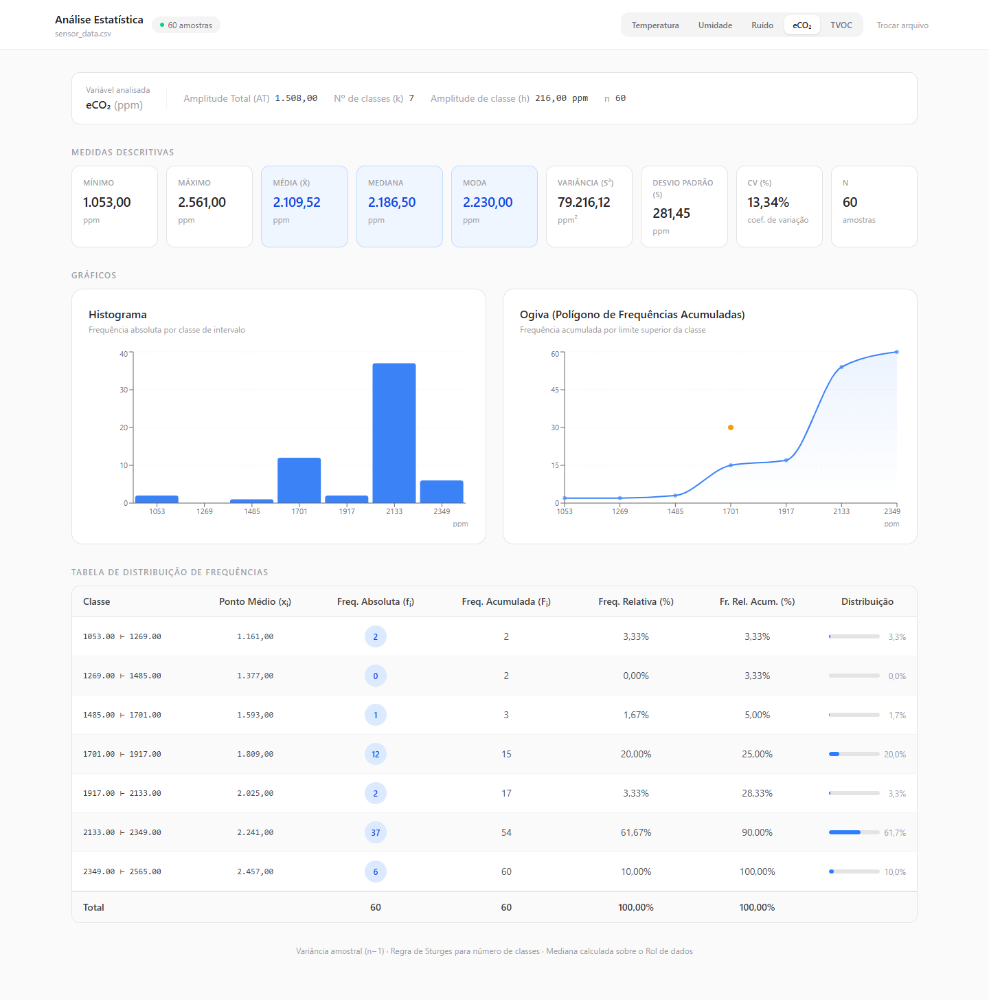

# Environmental Sensor Statistics Dashboard

A clean and responsive React + TypeScript web application for statistical analysis of CSV sensor datasets.

The app lets users upload CSV files, choose a metric (Temperature, Humidity, Noise, eCO2, TVOC), and automatically computes descriptive statistics and grouped frequency distributions with visual charts.

## Screenshot



## Features

- CSV upload (drag-and-drop or file picker)
- Automatic CSV parsing and field extraction
- Variable selector for multiple sensor measurements
- Frequency distribution table with:
  - class intervals
  - absolute frequency ($f_i$)
  - cumulative frequency ($F_i$)
  - class midpoint ($x_i$)
  - relative frequency
- Descriptive statistics:
  - mean
  - median
  - mode (amodal, unimodal, multimodal)
  - variance
  - standard deviation
  - coefficient of variation
- Data visualization:
  - histogram (grouped absolute frequencies)
  - ogive (grouped cumulative frequencies)
- Responsive UI for mobile, tablet, and desktop

## Tech Stack

- React 19
- TypeScript
- Vite 8
- Tailwind CSS 4 (PostCSS integration)
- Papa Parse (CSV parser)
- Recharts (data visualization)

## Project Structure

```text
.
|-- README-img/
|   `-- application.png
|-- src/
|   |-- components/
|   |   |-- Charts.tsx
|   |   |-- Dashboard.tsx
|   |   |-- FileUpload.tsx
|   |   |-- FrequencyTable.tsx
|   |   `-- icons/
|   |       `-- UploadCloud.tsx
|   |-- utils/
|   |   |-- csvParser.ts
|   |   `-- statistics.ts
|   |-- App.tsx
|   |-- index.css
|   `-- main.tsx
|-- postcss.config.js
|-- package.json
`-- vite.config.ts
```

## Getting Started

### 1. Install dependencies

```bash
npm install
```

### 2. Start development server

```bash
npm run dev
```

### 3. Build for production

```bash
npm run build
```

### 4. Preview production build

```bash
npm run preview
```

## CSV Format

The app expects CSV columns such as:

- `payload.temperature`
- `payload.humidity`
- `payload.noise`
- `payload.eco2`
- `payload.tvoc`
- `payload.timestamp`
- `payload.sector`
- `payload.device`

Rows missing numeric values for the supported metrics are ignored.

## Author Signature in UI

The interface includes a visible signature:

- `Giordano Bruno Biasi Berwig`
